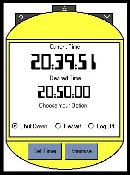



## Timer

### Description

This program you can set up to shutdown or restart or log off your computer at set time (clock must ne 24 hour format), the best things is you can set your computer up to play mp3s at night and you can then set your computer to shutdown at a set time, if you have an atx power supply it will actually turn off your computer
 
### More Info
 
sorry not well commented

may not work unless your computer is set to 24 hour format

             |
---                |---
**Submitted On**   |2000-11-18 10:13:50
**By**             |[Dean Chapman](https://github.com/Planet-Source-Code/PSCIndex/blob/master/ByAuthor/dean-chapman.md)
**Level**          |Intermediate
**User Rating**    |3.0 (9 globes from 3 users)
**Compatibility**  |VB 5\.0, VB 6\.0
**Category**       |[Complete Applications](https://github.com/Planet-Source-Code/PSCIndex/blob/master/ByCategory/complete-applications__1-27.md)
**World**          |[Visual Basic](https://github.com/Planet-Source-Code/PSCIndex/blob/master/ByWorld/visual-basic.md)
**Archive File**   |[CODE\_UPLOAD1180711182000\.zip](https://github.com/Planet-Source-Code/dean-chapman-timer__1-12897/archive/master.zip)

